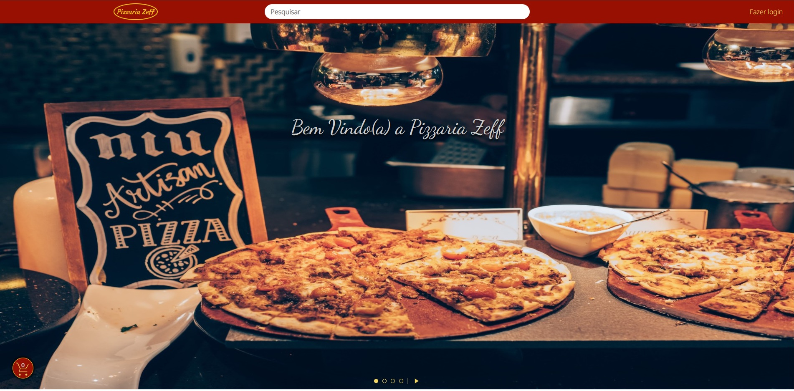

# Site Pizzaria Zeff

# Descrição

Esta aplicação é um site de uma pizzaria fictícia. A mesma consome o serviço web [web-service-pizzaria-zeff](https://github.com/kleberkaerk/web-service-pizzaria-zeff), para melhor atender aos usuários.

# Funcionalidades 

* Pesquisa produto(s) pelo nome.
* Exibe produtos encontrados na pesquisa.
* Exibe as características de um produto.
* Exibe slides automaticamente.
* Altera slides por meio de botões.
* Pausa slides.
* Exibe produtos em promoção.
* Adiciona produtos ao carrinho de compras.
* Deleta produtos do carrinho de compras.
* Exibe cardápio de produtos.

# Tecnologias utilizadas

1. HTML
2. CSS
3. TypeScript
4. Angular

# Execução

Para executar a aplicação localmente siga os seguintes passos:

* Navegue até o diretório raiz do projeto (onde se encontra o arquivo angular.json).
* Abra um terminal e execute o comando `ng serve`.

A partir deste ponto, a aplicação estará disponível para ser utilizada. Para ver a mesma em funcionamento acesse `http://localhost:4200/`.

# Testes Unitários

Para executar os testes unitários da aplicação siga os seguintes passos:

* Navegue até o diretório raiz do projeto (onde se encontra o arquivo angular.json).
* Abra um terminal e execute o comando `ng test`.

# Autor

[ Kleber Kaerk](https://github.com/kleberkaerk)